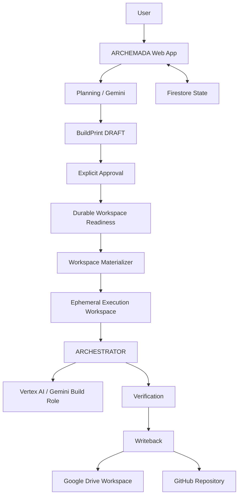

# ARCHEMADA Architecture

## Overview

ARCHEMADA separates user intent, engineering authority, execution, verification, and persistence.

The application is intentionally not a single model call wrapped in a UI. Critical state and lifecycle decisions are represented explicitly so the model can operate inside a controlled engineering job without becoming the authority for every boundary around that job.



## Application Layer

The ARCHEMADA application owns the boundaries closest to the user and account:

- browser experience;
- Google/Firebase identity;
- provider and model selection;
- planning interaction;
- BuildPrint persistence and lifecycle;
- durable workspace selection/readiness;
- execution initiation;
- billing/admission control;
- execution status presentation; and
- restoration of durable application state.

## Planning Layer

Planning is a structured conversation rather than an unbounded prompt chain.

The planner works through unresolved engineering targets and produces a BuildPrint when the required decisions are sufficiently resolved. Structured application state can mark targets as resolved before the model runs. This prevents already-established facts — such as an authorized workspace — from being re-decided by the model.

The planning system also resolves deterministic UI semantics outside the model where appropriate. For example, when the application presents numbered options, an answer such as `2` can be resolved against the active option set before model interpretation.

## BuildPrint Layer

The BuildPrint is the durable contract between planning and execution.

Its lifecycle currently includes:

```text
DRAFT -> APPROVED
  |         |
  +-------> CANCELLED
```

Revision creates a new draft lineage rather than rewriting historical approved artifacts.

Approval validates that the project destination is executable and that its durable workspace is ready. Approval does not itself start a paid build.

## Workspace Authority

ARCHEMADA distinguishes durable project authority from temporary execution storage.

### Google Drive

A user-selected Drive folder is authorized through the user's Google session using the narrow `drive.file` scope. Identity and Drive authorization are separate credentials: Firebase identity authenticates the ARCHEMADA account; the Google OAuth access token authorizes Drive operations.

The token is intentionally held in memory rather than persisted by the browser application.

### GitHub

An authorized GitHub repository can also act as a durable workspace. Repository destinations are normalized into machine-resolvable identities before they are allowed to participate in approval/execution.

## Materialization

Remote workspaces are converted into a bounded local execution workspace through a materializer boundary.

```text
Durable source
    -> resolve source type
    -> materialize
    -> ephemeral execution path
    -> ARCHESTRATOR
```

The execution engine receives a workspace path; it does not need Drive- or GitHub-specific logic.

## ARCHESTRATOR Boundary

ARCHESTRATOR is the reusable engineering engine beneath ARCHEMADA.

ARCHEMADA determines which approved job should run and establishes the environment in which it may run. ARCHESTRATOR carries that approved engineering work through its bounded execution lifecycle.

This separation prevents the reusable execution engine from absorbing account, UI, provider-settings, durable-workspace, and product-policy responsibilities.

## Provider Roles

ARCHEMADA represents model roles independently:

- **PLAN** — planning/interview reasoning;
- **BUILD** — model-backed software construction;
- **VERIFY** — model-backed result evaluation.

BUILD and VERIFY may explicitly select their own provider/model or inherit the PLAN provider/model. Inheritance is application state, not a model guess.

The current Google path uses Gemini through Vertex AI.

## Admission and Billing

Durable workspace readiness, materialization, and provider capability are established before paid execution admission.

The intended order is:

```text
workspace readiness
-> materialization
-> provider capability
-> billing admission
-> RUNNING
```

Pre-admission failures do not intentionally consume build time.

## Verification

Verification is separated from generation.

Deterministic verification can inspect concrete properties such as whether required project checks execute successfully. Model-backed verification can then reason over the BuildPrint and produced result without replacing deterministic outcomes.

## Writeback

For remote workspaces, writeback is part of the completion boundary.

The result is synchronized back to the authorized durable source with drift protection where supported. Remote changes discovered between materialization and writeback can block overwrite rather than silently replacing newer work.

The execution environment is temporary; the durable workspace remains the project authority.

## State

Firestore is used for durable application state including account/provider configuration, BuildPrint lifecycle, and execution records.

This lets the UI restore meaningful engineering state without relying on the browser transcript as the sole source of truth.

## Security Boundary

ARCHEMADA separates:

- identity credentials;
- provider credentials;
- Drive authorization;
- durable project state; and
- ephemeral execution state.

Secrets are not intentionally written into BuildPrint content or project workspaces.

For more detail on the public security posture, see [../SECURITY.md](../SECURITY.md).
