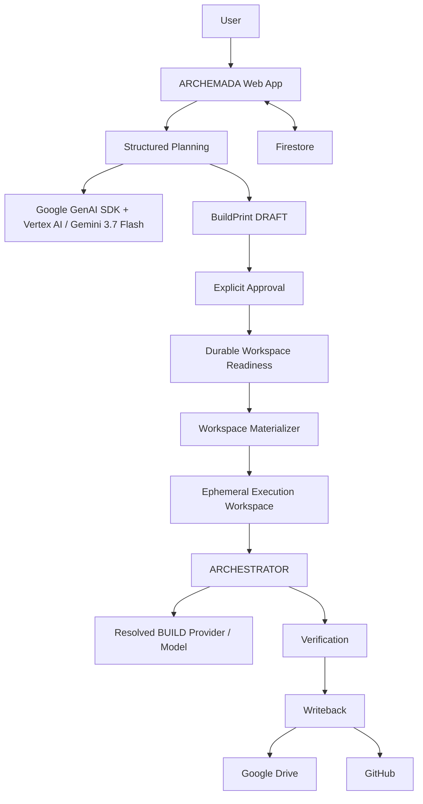

# ARCHEMADA Architecture

## Source of Truth

The private `ArchePersona/Archemada` implementation repository is authoritative for current behavior. This document mirrors externally relevant architecture from that implementation.

## Overview

ARCHEMADA separates user intent, engineering authority, execution, verification, and persistence.

Critical lifecycle and authority decisions are explicit application state rather than model-owned convention.



## Application Boundary

ARCHEMADA owns the application-specific control surface:

- browser interaction;
- Firebase-backed identity;
- provider/model configuration;
- planning interaction;
- BuildPrint persistence and lifecycle;
- durable workspace selection and readiness;
- execution initiation;
- pre-admission validation;
- billing/admission boundaries; and
- execution state presentation.

## Planning Provider

The current default provider is `vertex_ai`.

The native planning adapter uses the Google GenAI SDK in Vertex mode:

```text
genai.Client(vertexai=True, project="archemada", location="global")
    .models.generate_content(model="gemini-3.7-flash", ...)
```

Production authentication uses Application Default Credentials from the runtime identity. The browser does not provide a Vertex API key.

## BuildPrint Authority

BuildPrint records are account-owned and stored in Firestore.

Current lifecycle:

```text
DRAFT -> APPROVED
  |         |
  +-------> CANCELLED
```

BuildPrint content is hashed deterministically. Approval is ownership-checked and idempotent. Revision creates a new DRAFT lineage rather than modifying the historical approved artifact.

Approval also verifies that the BuildPrint's destination is executable and that the corresponding durable workspace is ready.

## Durable Workspace Readiness

Workspace readiness is backend-authoritative.

### Google Drive

A Drive workspace is ready only when:

- an actual Drive destination is recorded for the account;
- the BuildPrint destination matches that recorded destination; and
- the backend has recorded `drive_ready=true` after resource verification.

Immediately before execution, Drive-backed work is re-probed with the live interactive Drive token.

### GitHub

A GitHub workspace must be a canonical repository destination and the server must hold GitHub write authority. Read-only clone access is not treated as READY.

### No Production Fallback

There is no user-facing local or ephemeral fallback. `local_path` exists only as an internal test/development seam.

## Provider Roles

The application resolves three provider roles independently:

```text
PLAN
BUILD
VERIFY
```

The approved BuildPrint carries planning provenance. BUILD and VERIFY can use explicit account configuration or inherit from PLAN. That inheritance is resolved by application code before execution.

## Pre-Admission Ordering

The implementation intentionally validates critical execution capability before billing admission:

```text
workspace readiness
-> live Drive re-probe when applicable
-> effective BUILD provider/model resolution
-> provider capability check
-> materialization / execution preparation
-> billing admission
-> RUNNING
```

For the Vertex path, provider initialization is probed before admission.

## Materialization Boundary

Durable workspaces are translated into a local execution path by the materializer layer.

```text
Durable source
-> source-type resolution
-> materialize
-> ephemeral execution directory
-> ARCHESTRATOR
```

ARCHESTRATOR operates on the prepared workspace path and does not need to own Google Drive or GitHub account semantics.

## ARCHESTRATOR Boundary

ARCHESTRATOR is the reusable engineering lifecycle beneath ARCHEMADA.

ARCHEMADA establishes the approved job, workspace authority, provider configuration, and admission conditions. ARCHESTRATOR carries that approved job through execution.

## State

Firestore is authoritative for durable application state such as:

- BuildPrint lifecycle;
- account/provider configuration;
- workspace authority/readiness; and
- execution linkage/state.

The browser renders this state; it is not the durable source of truth.

## Security Separation

The implementation separates:

- Firebase account identity;
- Vertex runtime identity;
- Google Drive OAuth authorization;
- provider credentials for non-Vertex providers;
- BuildPrint/application state; and
- ephemeral execution files.

Secrets are not intended to become BuildPrint content or durable project artifacts.
