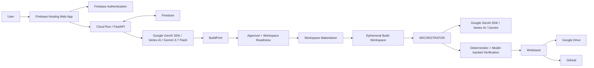

# ARCHEMADA Hackathon Architecture

## System View



## Why the System Is Split This Way

ARCHEMADA separates three kinds of authority:

1. **User/product authority** — what the user requested and approved.
2. **Engineering execution** — how the approved work is carried forward.
3. **Durable project authority** — where the software actually lives after execution ends.

The model participates in reasoning and software construction, but those three authorities are not delegated entirely to model output.

## Frontend

The browser application provides:

- planning interaction;
- provider/model controls;
- BuildPrint review;
- explicit build/cancel/revise controls;
- durable workspace configuration;
- execution status and telemetry presentation; and
- Google account interaction.

The browser does not define backend workspace readiness or final execution authority.

## Cloud Run API

The FastAPI service on Cloud Run owns server-side application boundaries including:

- authenticated account operations;
- planning requests;
- BuildPrint persistence/lifecycle;
- workspace validation/materialization;
- execution admission;
- provider capability resolution;
- execution record management; and
- writeback orchestration.

## Firestore

Firestore stores durable application state rather than relying on the chat transcript or browser memory.

State includes account/provider configuration, BuildPrint records, lifecycle state, and execution-related records.

## Gemini / Google GenAI SDK

ARCHEMADA uses the Google GenAI SDK with Gemini through the Google/Vertex provider path.

Model roles are separated into PLAN, BUILD, and VERIFY so each stage has explicit provider/model provenance. BUILD and VERIFY may inherit PLAN when an override is not selected.

## BuildPrint

The BuildPrint is the durable bridge from conversational planning to execution.

It turns the planning result into application state that can be approved and later referenced by execution without depending on the model to reconstruct the user's intent from transcript history.

## Workspace Materialization

ARCHEMADA currently supports remote durable workspaces including Google Drive and GitHub.

A materializer converts the authorized remote source into a temporary local workspace before ARCHESTRATOR begins execution. This allows the execution engine to work against a normal filesystem without embedding provider-specific remote-storage logic.

## ARCHESTRATOR

ARCHESTRATOR is a separate reusable engineering engine incorporated by ARCHEMADA.

It predates the contest and is disclosed as pre-existing technology. ARCHEMADA itself — the hackathon project — was created during the contest period.

Within the submitted system, ARCHESTRATOR is responsible for carrying approved engineering work through the bounded software-construction lifecycle.

## Verification

Verification is intentionally distinct from generation.

ARCHEMADA can combine concrete deterministic checks with model-backed assessment. A model can interpret evidence, but deterministic failures remain concrete failures rather than opinions the model can erase.

## Writeback

The temporary Cloud Run filesystem is not treated as the final project.

A successful remote-workspace execution writes the resulting software back to the approved durable destination. Where supported, source-version identity is compared to detect remote drift before overwrite.

## Failure Boundaries

The architecture is designed so several common failures happen before paid execution admission:

```text
workspace invalid
workspace unauthorized
materialization failure
provider unavailable
        ↓
NO RUNNING EXECUTION
```

Only after required preconditions are established does the build enter the execution/billing lifecycle.
